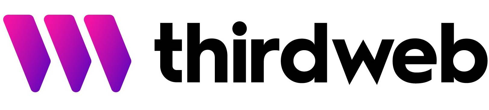

# In today's build, you're gonna learn about

👉  How to use React JS to build the Frontend of a Web Application

👉  How to use thirdweb to build the backend needed for an Ethereum APP

👉  Hosting your Web 3.0 APP on the Internet using Vercel

and more...

## Love your beautiful face 🔥

## BackEnd API Created

thirdweb.com custom API Create 

change a CP Punks copy address and paste the bold text

axios.get('https://testnets-api.opensea.io/assets?asset_contract_address=<b>0xf1C53f1845906a942E6F22a745A5cD75F515dD59</b>&order_direction=asc');
